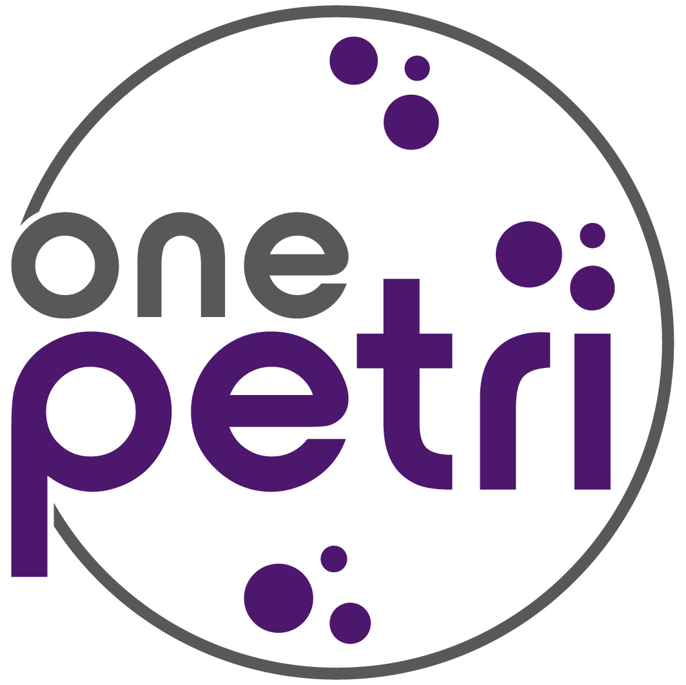

     
  

# OnePetri - Trained Models
### AI-Powered Petri Dish Analysis

Michael Shamash  
Maurice Lab  
McGill University  
michael@onepetri.ai

## Current Version - Trained Models
The latest Petri dish detection model is v1.1. The latest plaque detection model is v1.1.

## Citation
*Coming soon...*

---

## Table of Contents
1. [About OnePetri](#about)
2. [Model Description](#models)
3. [Contact](#contact)
4. [Copyright](#copyright)

---

## About OnePetri 
OnePetri is an iOS application which uses machine learning models & computer vision to accelerate common microbiological workflows by automatically detect Petri dishes and plaques, count plaques, and perform assay calculations with these values.

For more information, please visit the OnePetri website [here](https://onepetri.ai), or GitHub repo [here](https://github.com/mshamash/OnePetri).

## Model Description 
*Coming soon...*

## Contact 
If you have any questions or comments on the OnePetri models in this repo, please contact Michael Shamash (michael@onepetri.ai) or [create a GitHub issue in this repository](https://github.com/mshamash/onepetri-models/issues)!

## Copyright 
OnePetri - AI-Powered Petri Dish Analysis  
Copyright (C) 2021 Michael Shamash  